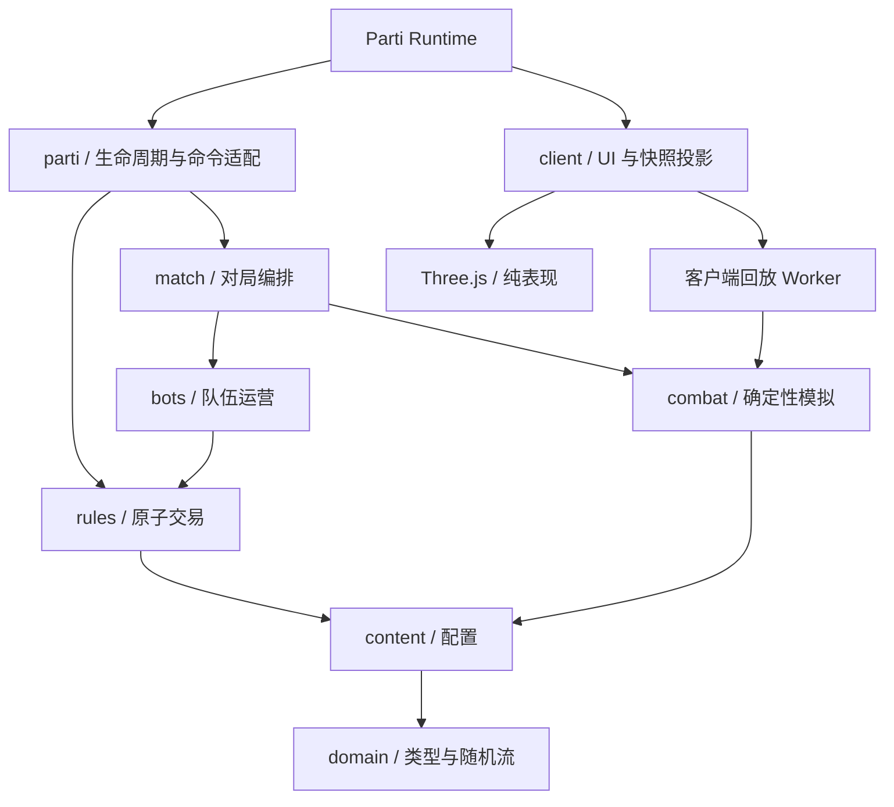

# 架构与决策

## 模块依赖

边界由 `tools/check-boundaries.mjs` 检查。纯逻辑层禁止第三方运行时依赖、DOM、Three.js、`Math.random()` 和真实时间。`client/local-*` 是显式的开发适配器例外，用来运行同一份房间定义，不进入生产 bundle。

- `domain`：可序列化数据、命令及结果类型，PRNG 与稳定哈希。
- `content`：只依赖 domain。配置在构建和房间创建/恢复时校验。
- `rules`：只依赖 domain/content。命令先在状态副本执行，完全成功才提交。
- `combat`：只接收被冻结的阵容。不得从 GameState 读取实时商店、经济或玩家操作。
- `bots`：只通过 `applyCommand` 修改游戏资源。可以直接维护自己的有界策略日志和行动计数。
- `match`：推进回合、配对、冻结阵容、提交结果、淘汰及排名。
- `parti`：身份、计时器和传输，不能建立第二套游戏规则。
- `client`：把权威快照转换为交互视图、棋子模型和回放帧；不能修改权威结果。

## ADR 001：单房主权威、开放信息

正式状态只存在于房主 Worker 的 `ctx.state`。真人客户端提交意图，身份取自 Parti action handler 的 `event.player`，不相信 payload 自报的 owner。

首版是朋友合作游戏，商店、机器人决策、随机流和卡池采用开放信息。不存在依赖模块变量保存的秘密。所有恢复所必需的数据都在 GameState 中；模块变量仅保存可由冻结输入重建的计算过程。

`Command` 携带 `commandId`、回合；购买校验 `shopVersion`，棋子操作校验 `unitVersion`，换位额外校验 `targetId` / `targetVersion`，装备操作同时校验 `itemSlot` 和 `itemId`。最近 64 个请求结果按操作者保存，支持短期重试防重；这不是永久请求历史。过期回合不能再次修改状态。

交易在副本上完成，失败时不扣金币、不拿走卡池副本、不移动棋子。反馈由 `game:command` 返回。`parti.action()` resolve 仅代表已发出，不代表交易成功。

## ADR 002：确定性离散战斗

`createBattle → stepBattle → finishBattle` 可在 Node、房主 Worker、客户端 Worker 中运行同一实现。

- 20 Hz，最多 900 步。生命、攻击、坐标、冷却、状态时间均为整数。
- xorshift32 为显式随机流；不同系统通过 seed 派生独立流。
- 字符串排序使用明确的码位比较，不依赖 locale。
- 战场 10×10，八邻接 BFS，地面禁止穿角；空地占位独立。
- 攻击和技能经过确定性的起手、释放、命中和恢复阶段；同 tick 命中统一结算，因此允许同归于尽。控制可取消尚未释放的动作，已释放弹道保留到命中 tick。
- 死亡效果有界，整场最多创建 64 个实体，包括已死亡召唤物，以同时约束运算和回放体积。
- 战斗事件及最终实体状态参与摘要；哈希用于诊断确定性，不证明远端计算可信。

UnitInstance 只保存长期归属、星级、装备和准备位置。CombatEntity 保存临时生命、能量和战斗位置。双方阵容复制到 BattleDescriptor 后，战斗不会改写玩家原棋子。

## ADR 003：分批快进计算，客户端独立播放

`BattleExecutor` 只有 `advance(steps)` 和 `done`。当前实现 `LocalBattleExecutor` 轮转任务，真人有关的战斗优先。房主每次定时器调用推进一场的 8 个逻辑步，然后归还事件循环。没有异步 action，也没有嵌套服务器。

计算阶段 `deadline=0`。全部结果得到后开启统一播放区间，时长为本轮最长战斗，最少 2 秒。播放结束后统一结算，再展示 3 秒结果。较短战斗显示结束局面直至整轮结束。此设计避免提前结算经济与仍在播放的战斗矛盾。

客户端回放 Worker 只模拟正在观看的一场，每 4 个逻辑步生成表现帧。帧中包含持续状态、当前动作和在途弹道快照，主线程按事件的精确 tick 播放前后摇、预警、弹道与命中特效；跳播或重连时由快照重建持续表现。显示变化不能改变伤害时间。模型几何、材质和特效对象池复用，销毁场景时释放 GPU 资源。

权威快照包含冻结输入和结果，不包含逐帧生命和位置。房主重建回放通过有序 `game:replay` 事件按需发给请求者，丢失或乱序时客户端不拼接错误记录。新加入/重连不依赖这些一次性事件。

计时器以房主时间为准。客户端通过 `clock` action 采样剩余时间，并用本地单调时钟显示倒计时，减少设备时钟偏差。重连中途按剩余时间定位回放。倒计时仅供显示，是否接受操作由房主判断。

## ADR 004：恢复和故障边界

- 准备阶段恢复：保留商店、金币、布阵、机器人进度，重新给予 25 秒；不重复发工资、经验或刷新。
- 战斗阶段恢复：保留所有已提交结果，未完成任务从冻结输入重新计算；重新安排播放时间。
- 结算阶段恢复：`settledRound` 已记录，只安排下一轮，不重复扣血或发钱。
- 计算异常：进入 error，停止主要阶段计时器，由房主重试，不提交估算胜负。
- 非房主离线：现有阵容继续参战，不自动托管。Parti 可恢复原身份时，继续使用原席位。
- 等待大厅永久离开的玩家可释放游戏席位。开局后不把原席位转给新身份。
- 主机迁移、跨版本迁移、永久存档不在范围内。恢复能力依赖 Parti 的同版本快照契约。

规则、内容哈希与模拟版本随房间包固定。变更战斗行为需要更新模拟版本；已运行房间不热升级。客户端版本不符则停止接收和回放该局。

## ADR 005：先测量再增加分布式复杂度

常规 4 场，野怪最多 8 场；正式阵容每场最多 32 个初始单位。性能工具还提供 64 初始实体的额外压力场景，该场景不通过正式人口规则生成。

`pnpm bench` 报告 Node CPU 时间，排除浏览器定时器等待、网络、渲染。Parti `game:performance` 日志报告房主设备上的计算时间与快照大小。整轮实际墙钟时间可能因浏览器计时器节流而增加；隐藏或锁屏的手机可能暂停 Worker。

如果手机验收超预算，先优化重复查找、目标/路径缓存、对象分配和切片大小，再考虑本机 Worker 池。跨设备计算只有在可信度、超时重派和收益都明确后才引入；仅比对哈希不能证明机器人后台战斗结果正确。

## 与 Parti 的公开契约

依据用户指定的 `../parti/docs/getting-started.md` 及同目录 `worker-api.md`、`client-api.md`、`manifest.md`、`room-dev-harness.md` 实现。未修改 Parti 代码。构建器把源代码模块合并为单文件权威 Worker，保留 canonical `defineRoom` import，并改写 default export 以满足加载器契约。

## ADR 006：全屏游戏交互与共享布阵判定

0.2.0 将原来的集中 UI 拆成应用协调器、DOM HUD、输入控制器、场景控制器、回放控制器与资源缓存，见 [界面与操作系统](ui-interaction.md)。`main.ts` 仅启动和销毁应用，不承载规则和交互分支。

`domain/placement.ts` 是无平台依赖的布阵判定。输入是只读 GameState、操作者、双方 ID/版本及位置；限制数值由 content 提供，参与内容哈希。输入控制器用同一判定显示落点，rules 在权威事务内再次调用。UI 判定不会预先扣费或移动正式棋子。

`swap` 是一次交易，先验证双方版本、归属权限、位置与最终人口，再同时交换位置并递增版本。没有两个 move 之间的临时空格，也不合成或改变归属。原 public 交付路径不变。覆盖双方版本、重复请求、禁止区域、失败原子性，以及 72 组拥有者/区域/操作组合的预览与执行一致性测试。

本地操作中间态不写入快照：拖拽预览跟随指针，GameState 原位置保持不变。源版本变化取消手势，未改变源的快照保留操作；等待正式回执时锁定相关对象。成功反馈以快照 receipts 为准，action 发送完成不能解锁业务操作。版本不匹配时停止本地回放和输入，要求进入对应包。

UI 包版本仍为 0.2.0，规则 ID 为 `twins-original-02`；确定性动作阶段、可打断起手、范围落点命中和延时自爆将模拟版本升级为 2。旧房间不做热升级或迁移。
